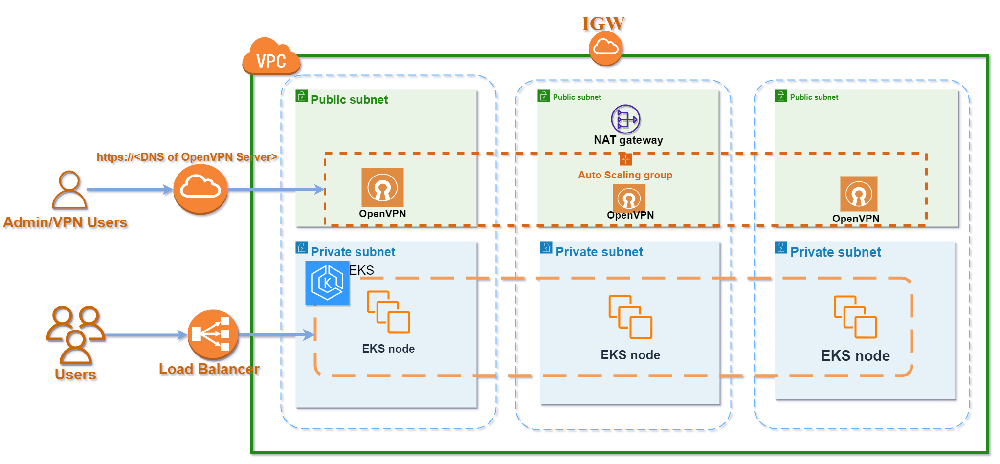

# Child modules of AWS Resources

# Infrastructure modules that contains:
- _Modules for s3 backend to store .tfstate files_
- _Networking modules_
- _Bastion module_
- _VPN module_
- _EKS Cluster module_

## **Diagram**

## Terraform applying queue:
1. S3 Backend should be applying first to store .tfstate files of another modules
2. Networking module should be second to create resource in.
3. EKS Cluster or VPN Module.