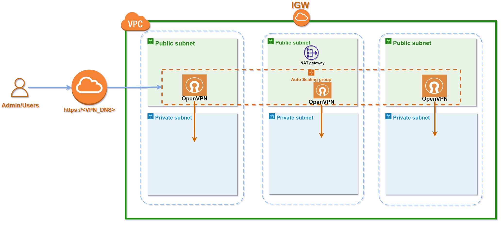

# AWS VPN Server Terraform module

## This module will create:
- _VPN Server with Load Balancer_

## **Diagram**


## **Usage**
```terraform
module "vpn" {
  source      = "git::<URL_OF_THIS_REPO>//vpn?ref=main"
  vpc_id      = <vpc_id>
  vpn_subnets = <subnets_id>
  env         = <env_name>
}

```

```bash
export AWS_ACCESS_KEY_ID=<write your access key id>
export AWS_SECRET_ACCESS_KEY=<write you secret access key>
export AWS_DEFAULT_REGION=<write default region to create resource in>
```

Then perform the following commands on the root folder:
- `terraform init` terraform initialization
- `terraform plan` to see the infrastructure plan
- `terraform apply` to apply infrastructure build
- `terraform destroy` to destroy the infrastructure

## **Resources**
|Name|Type|
|----|----|
|[aws_launch_template.vpn_launch_template](https://registry.terraform.io/providers/hashicorp/aws/latest/docs/resources/launch_template)|resource|
|[aws_autoscaling_group.vpn_auto_scaling_group](https://registry.terraform.io/providers/hashicorp/aws/latest/docs/resources/autoscaling_group)|resource|
|[aws_security_group.vpn_sg](https://registry.terraform.io/providers/hashicorp/aws/latest/docs/resources/security_group)|resource|
|[aws_security_group_rule.openvpn_rule](https://registry.terraform.io/providers/hashicorp/aws/latest/docs/resources/security_group_rule)|resource|
|[aws_security_group_rule.openvpn_admin_rule](https://registry.terraform.io/providers/hashicorp/aws/latest/docs/resources/security_group_rule)|resource|
|[aws_security_group_rule.openvpn_client_rule](https://registry.terraform.io/providers/hashicorp/aws/latest/docs/resources/security_group_rule)|resource|
|[aws_security_group_rule.openvpn_http_rule](https://registry.terraform.io/providers/hashicorp/aws/latest/docs/resources/security_group_rule)|resource|
|[aws_security_group_rule.openvpn_ssh_rule](https://registry.terraform.io/providers/hashicorp/aws/latest/docs/resources/security_group_rule)|resource|
|[aws_lb.vpn_lb](https://registry.terraform.io/providers/hashicorp/aws/latest/docs/resources/lb)|resource|
|[aws_lb_target_group.vpn_target_group](https://registry.terraform.io/providers/hashicorp/aws/latest/docs/resources/lb_target_group)|resource|
|[aws_lb_listerer.vpn_lb_listener](https://registry.terraform.io/providers/hashicorp/aws/latest/docs/resources/lb_listener)|resource|
|[aws_ami.vpn_ami](https://registry.terraform.io/providers/hashicorp/aws/latest/docs/data-sources/ami)|data source|
|[aws_kms_alias.kms-ebs](https://registry.terraform.io/providers/hashicorp/aws/latest/docs/data-sources/kms_alias)|data source|
|[aws_instance.vpn](https://registry.terraform.io/providers/hashicorp/aws/latest/docs/data-sources/instance)|data source|


# **Inputs**
|Name|Description|Type|Default|Required|
|----|-----------|----|-------|--------|
|`env`|Environment name to create resource in.|`string`|no|true|
|`tags`|A mapping of tags to assign.|`map(string)`|`{}`|no|
|`instance_type`|Instance size of the VPN.|`string`|`t2.medium`|true|
|`vpn_additional_security_groups`|List of additional security groups to attach to the launch template|`list(string)`|`[""]`|no|
|`vpn_key_pair`|Select the key pair to use to launch the vpn.|`string`|`""`|no|
|`disk_size`|Root EBS size in GB.|`number`|`8`|yes|
|`disk_encrypt`|Instance EBS ecrypt|`bool`|`true`|no|
|`vpn_subnets`|List of subnets were the Auto Scaling Group will deploy the instances|`list(string)`|no|yes|
|`vpc_id`|VPC ID were we'll deploy the VPN.|`string`|no|yes|
|`vpn_ports`||`list(string)`|`[22,942,443]`|yes|

# **Outputs**
|Name|Description|
|----|-----------|
|`vpn_public_ip`|Public IP of the VPN Server.|
|`vpn_dns`|Public DNS of VPN Server.|
|`vpn_lb_dns`|AWS LB DNS Name.|